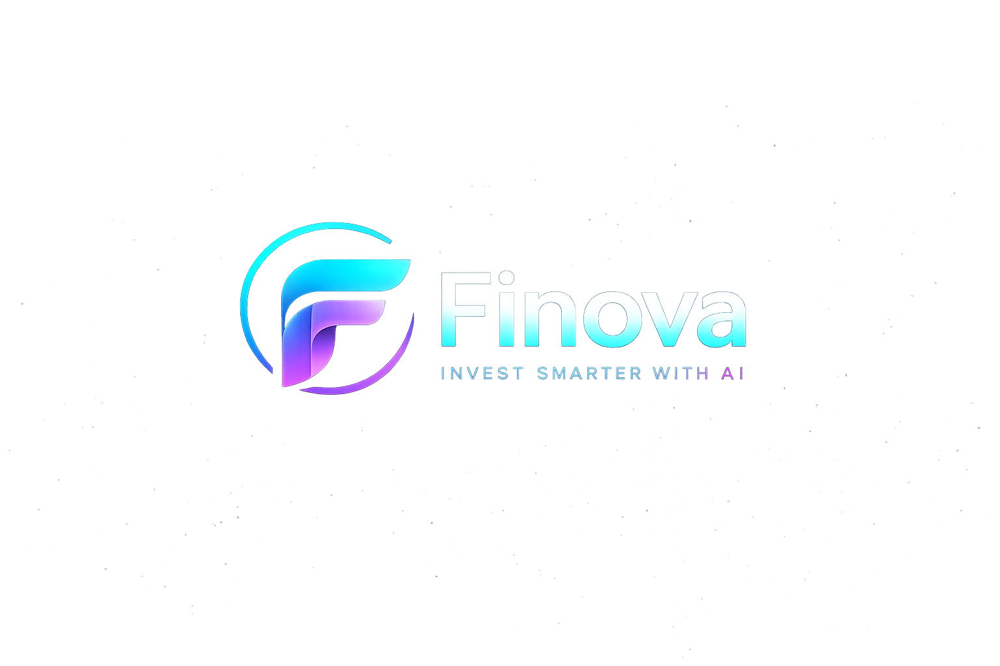

# Finova - AI Investment Copilot 🚀



**Finova** is a student-level AI Investment Copilot project built to explore the integration of AI with financial data. It provides basic market data, portfolio tracking, and an AI chat interface (powered by the Gemini API) to help understand stock market trends.

This project was built for learning purposes to explore full-stack development using Next.js, Express, and Firebase.

## 🌟 Features

- **Modern UI:** Built with React, Tailwind CSS, and shadcn/ui for a clean and responsive design.
- **AI Chat:** Uses Google's Gemini API to answer basic finance and stock-related questions.
- **Market Data:** Fetches real-time stock information using the Alpha Vantage API.
- **Authentication:** Simple user login and session management using Firebase Auth.
- **Unified Full-Stack:** A single Next.js application running with a custom Express server.

## 🏗️ Tech Stack

- **Frontend:** Next.js 16 (App Router), React, TypeScript, Tailwind CSS
- **Backend:** Custom Node.js/Express server (`server/server.ts`)
- **APIs & Services:** Firebase Admin SDK, Google Gemini API, Alpha Vantage API

## 💻 Local Setup

### 1. Environment Variables

Create a `.env.local` file at the root of the project and add your API keys:

```env
PORT=10000
NODE_ENV=development

# Backend API Keys
GEMINI_API_KEY=your_gemini_key_here
ALPHA_VANTAGE_API_KEY=your_alpha_vantage_key_here
FIREBASE_SERVICE_ACCOUNT_KEY=your_base64_encoded_firebase_json

# Frontend Firebase Config
NEXT_PUBLIC_FIREBASE_API_KEY=your_key
NEXT_PUBLIC_FIREBASE_AUTH_DOMAIN=your_project.firebaseapp.com
NEXT_PUBLIC_FIREBASE_PROJECT_ID=your_project_id
NEXT_PUBLIC_FIREBASE_STORAGE_BUCKET=your_project.appspot.com
NEXT_PUBLIC_FIREBASE_MESSAGING_SENDER_ID=your_sender_id
NEXT_PUBLIC_FIREBASE_APP_ID=your_app_id
```

### 2. Install & Run

Install the dependencies:
```bash
npm install
```

Start the development server:
```bash
npm run dev
```

- Open [http://localhost:10000](http://localhost:10000) in your browser to view the app.

## 🚀 Deploying to Render

This project is configured to be deployed on Render as a simple Web Service.

1. Connect your GitHub repository to Render.
2. Render will automatically use the `render.yaml` file to set up the web service.
3. In your Render dashboard, add the required environment variables from your `.env.local` file.
4. Render will run `npm run build` and `npm start` automatically.

*Note: This is a student project, so error handling for missing APIs (like missing Alpha Vantage keys) will just return standard errors in the UI. Make sure your API keys are added in the Render dashboard.*
